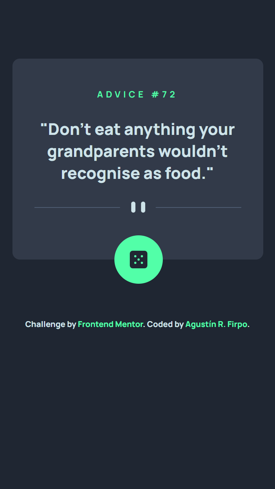
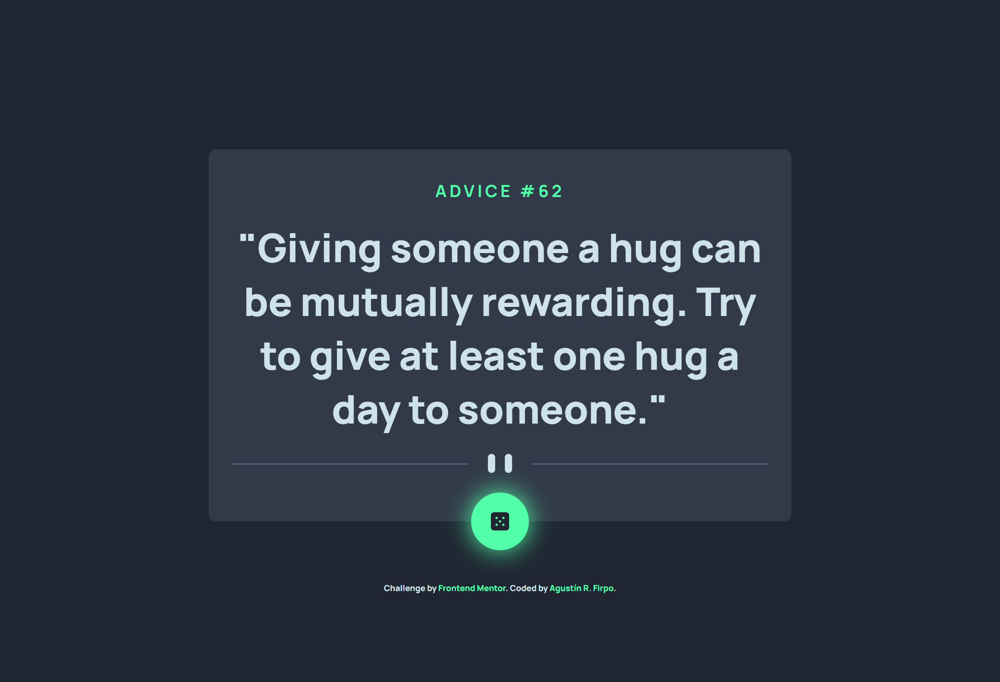

Hi everybody! 👋

This is a solution to the [Advice generator app challenge on Frontend Mentor](https://www.frontendmentor.io/challenges/advice-generator-app-QdUG-13db).

## Table of contents 🧾

- [Overview](#overview)
  - [The challenge](#the-challenge)
  - [Screenshot](#screenshot)
  - [Links](#links)
- [My process](#my-process)
  - [Built with](#built-with)
  - [What I learned](#what-i-learned)
  - [Continued development](#continued-development)
- [Author](#author)

## Overview

### The challenge

Users should be able to:

- View the optimal layout for the app depending on their device's screen size

Mobile Layout:
****


Desktop Layout:


- See hover states for all interactive elements on the page



- Generate a new piece of advice by clicking the dice icon


### Links 🔗

- Solution: [Github Repository](https://github.com/Arfirpo/advice-generator-app-main)
- Solution: [Github PAge](https://arfirpo.github.io/advice-generator-app-main/)

## My process ⚙️

### Built with 🛠️

- Semantic HTML5 markup
- Flexbox
- Mobile-first workflow
- [Sass](https://sass-lang.com/) - Css preprocessor
- Javascript
- Api/Json Files

### What I learned 📚

In this challenge i learned how to use an api (this time was the Advice slip API), how to manipulate it with javascript (using fetch, then & catch). Also i learned how to aplicate the math function to generate a random number

```js
diceBtn.addEventListener('click', ()=>{
  //calling the created function below
    getAdvice();
});


function getAdvice(){
    //generate a random number
    const id = Math.floor(Math.random() * 100) + 1;
    //calling the api with the functions fetch & them
    fetch(`https://api.adviceslip.com/advice/${id}`)
    .then(res=>{
        return res.json()
    }).then(data =>{
    //show the api values in the html
        let adv = data.slip.advice;
        adviceTxt.innerHTML = `"${adv}"`;
        adviceId.innerHTML = `${id}`;
    })
    .catch(err => getAdvice()); 
}
```

### Continued development 🔨

In the next challenges i would like to deep my knowledge about the handling of apis and its link whit html.


## Author 🙋🏻‍♂️

- Twitter/X - [@agus_firpo](https://twitter.com/agus_firpo)
- Frontend Mentor - [@Arfirpo](https://www.frontendmentor.io/profile/Arfirpo)
- Linkedin - [Agustín Rodrigo Firpo](https://www.linkedin.com/in/agustin-rodrigo-firpo-0aa86697/)